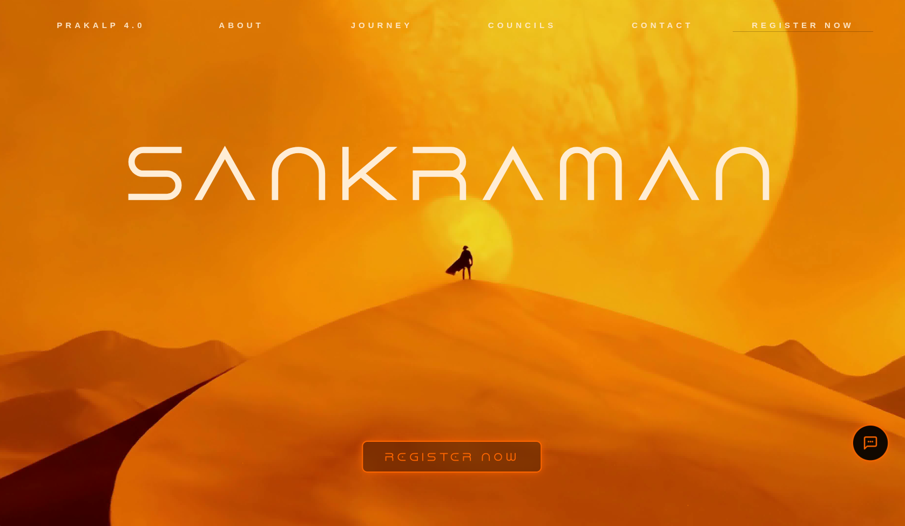
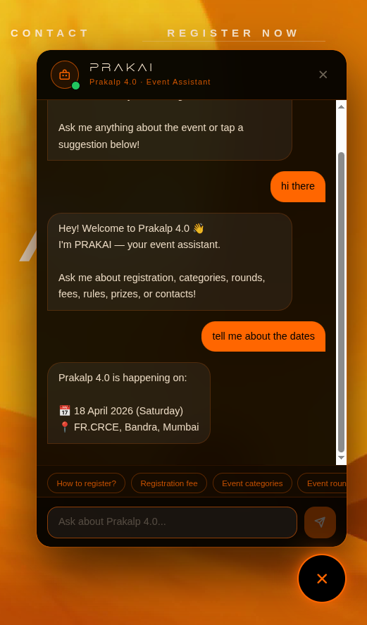
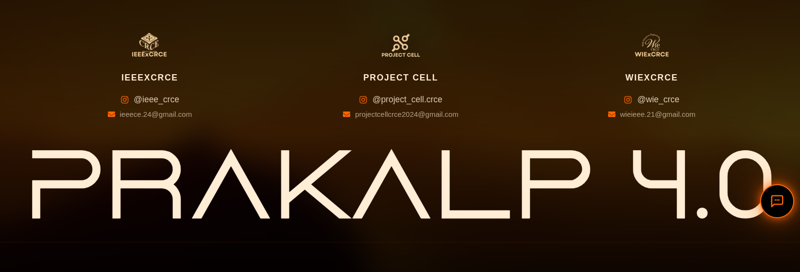
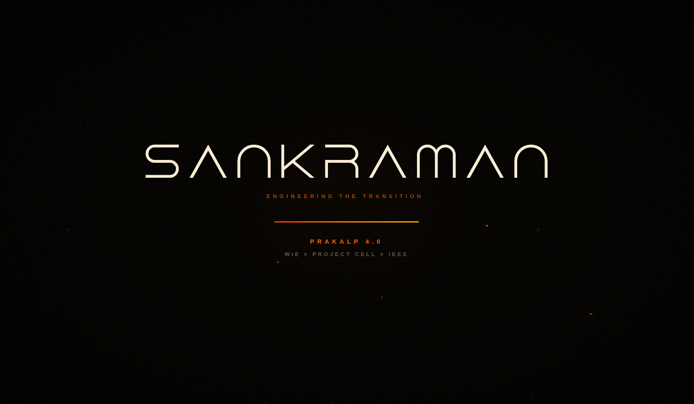

# Prakalp 4.0 - Sankraman Website

A stunning, fully responsive Next.js website for **Prakalp 4.0**, a college-level innovation challenge and hackathon event. This project showcases modern web design with smooth animations, glassmorphism UI patterns, and an immersive "Dune"-themed aesthetic.

## Website Overview

The Sankraman website is a modern, immersive landing page for **Prakalp 4.0**, an innovation challenge hosted by FR.CRCE. The site features a striking desert-themed aesthetic with smooth animations and an interactive AI chatbot assistant.

### 📸 Website Showcase

#### Landing & Hero Page

*The hero section features the iconic "Sankraman" branding with smooth parallax effects and navigation menu. The site uses warm orange and dark brown tones to create an epic, adventure-themed atmosphere.*

#### Event Information & AI Chatbot

*PRAKAI 4.0 - The intelligent event assistant chatbot powered by NLP technology. Users can ask questions about registration, categories, dates, fees, and event logistics. The chatbot provides real-time information and assists with event navigation.*

#### Footer with Council Information

*The footer displays organizing councils (IEEE CRCE, Project Cell, WIE CRCE) with their contact information and social media handles for easy communication.*

#### Loading Screen Animation

*Beautiful animated loading sequence that greets users when they first visit the site, setting the tone for the immersive experience.*

## Features

### 🎨 Design & UX
- **Glassmorphism UI**: Modern, elegant design with frosted glass effects
- **Smooth Animations**: Powered by Framer Motion and Anime.js for engaging scroll-triggered animations
- **Dune-Inspired Theme**: Dark, epic aesthetic with orange (#ff6600) accent colors
- **Fully Responsive**: Optimized for mobile, tablet, and desktop screens
- **Loading Screen**: Beautiful animated loading sequence on page load
- **Ambient Particles**: Floating particles create atmosphere throughout the site

### 📱 Page Sections
1. **Hero Section** - Eye-catching landing with parallax scrolling and council logos
2. **About Section** - Event overview with key statistics
3. **Journey Section** - Timeline of competition phases (3 rounds) with animated progress line
4. **Councils Section** - Information about organizing councils (WIE, Project Cell, IEEE)
5. **Contact Section** - Event details, venue info, contact heads, and brochure downloads
6. **Footer** - Navigation and additional links

### 📦 Available Resources
- **Two Brochures**: 
  - FR.CRCE Teams Brochure (internal)
  - External Teams Brochure (for external college participants)
- **Event Information**: Date, time, location, nearest station
- **Contact Details**: WhatsApp links for quick communication with organizers

## Tech Stack

### Frontend Framework
- **Next.js 16.2.1** - React framework with App Router
- **React 19.2.4** - UI library
- **TypeScript 5** - Type safety

### Styling & Animation
- **Tailwind CSS 4** - Utility-first CSS framework
- **Framer Motion 12.38.0** - React animation library  
- **Anime.js 4.3.6** - JavaScript animation engine
- **Tailwind Merge** - Smart Tailwind class merging

### UI & Icons
- **React Icons 5.6.0** - SVG icon library (WhatsApp, Download icons, etc.)

### Development Tools
- **ESLint 9** - Code linting
- **TypeScript** - Type checking
- **Node.js** - Runtime environment

## Project Structure

```
sankramanv2/
├── app/
│   ├── page.tsx              # Main home page
│   ├── layout.tsx            # Root layout with fonts & metadata
│   ├── globals.css           # Global styles & Tailwind imports
│   └── error.tsx, global-error.tsx
├── components/
│   ├── HeroSection.tsx       # Landing hero with navbar & parallax
│   ├── Footer.tsx            # Footer component
│   ├── LoadingScreen.tsx     # Animated loading animation
│   ├── TransitionSection.tsx # Section transitions
│   ├── Chatbot.tsx           # AI chatbot component
│   ├── sections/
│   │   ├── AboutSection.tsx
│   │   ├── JourneySection.tsx
│   │   ├── CouncilsSection.tsx
│   │   ├── ContactSection.tsx
│   │   └── StatsSection.tsx
│   ├── ui/
│   │   ├── AmbientParticles.tsx  # Floating background particles
│   │   ├── AnimatedCard.tsx
│   │   ├── ScrambleText.tsx      # Animated text scramble effect
│   │   ├── ScrollBlurWrapper.tsx
│   │   ├── SectionDivider.tsx
│   │   └── funnel-chart.tsx
│   └── hooks/
│       ├── useMouseGlow.ts
│       └── useScrollAnimation.ts
├── public/
│   ├── logos/                # Council logos (wie.png, project_cell.png, ieee.png)
│   ├── brouchures/           # PDF documents for download
│   ├── fonts/                # Custom font files
│   └── *.jpg, *.png, *.svg   # Background & foreground images
├── package.json
├── tsconfig.json
├── next.config.ts
├── tailwind.config.ts
├── postcss.config.mjs
└── eslint.config.mjs
```

## Getting Started

### Prerequisites
- Node.js 18+ 
- npm, yarn, pnpm, or bun

### Installation

Clone the repository and install dependencies:

```bash
cd sankramanv2
npm install
```

### Development

Run the development server:

```bash
npm run dev
```

Open [http://localhost:3000](http://localhost:3000) in your browser. The page auto-updates as you edit files.

### Building for Production

Build the project:

```bash
npm run build
npm start
```

### Linting

Check code quality:

```bash
npm run lint
```

## Key Components

### HeroSection
- Sticky header with navigation menu
- Parallax scrolling text effect
- Mobile hamburger menu
- Register CTA button
- Council logos at bottom
- Smooth scroll chevron animations

### JourneySection
- 3-phase timeline of competition
- Animated progress line that grows with scroll
- Card-based event descriptions
- Alternating left/right layout
- Glassmorphic cards with hover effects

### CouncilsSection
- Grid display of three organizing councils
- corner accent borders
- Council logos and descriptions
- Smooth entrance animations

### ContactSection
- **Resources**: Downloadable brochures
- **Event Venue**: Location details with Maps link
- **Contact Heads**: 3 organizers with WhatsApp links
- Glass-morphic cards with hover lift effects

## 🤖 AI Chatbot - PRAKAI 4.0

The Sankraman website features **PRAKAI** (Prakalp AI Assistant), an intelligent event assistant powered by **Natural Language Processing (NLP)** technology. This conversational AI is designed to provide seamless event information and support to participants.

### Chatbot Capabilities

PRAKAI leverages NLP to understand and respond to user queries about:

#### Event Information
- **Event Date & Time**: Provides Prakalp 4.0 schedule (18 April 2026, Saturday)
- **Venue Details**: Shares location information (FR.CRCE, Bandra, Mumbai)
- **Event Categories**: Information about different competition categories and rounds

#### Registration & Logistics
- **How to Register**: Step-by-step registration guidance
- **Registration Fee**: Details about participation fees
- **Requirements**: Participant eligibility and team requirements
- **Event Rules**: Rules and guidelines for competition

#### Interactive Features
- **Real-time Responses**: Uses NLP to parse user intent and provide contextual answers
- **Conversation Flow**: Maintains context across multiple messages
- **Suggestion Buttons**: Quick-action buttons for common queries:
  - "How to register?"
  - "Registration fee"
  - "Event categories"
  - "Event rounds"
- **Friendly Assistant**: Welcoming tone with emoji support and helpful prompts

### Technical Implementation

- **NLP Engine**: Advanced natural language understanding for semantic meaning extraction
- **Intent Classification**: Categorizes user queries into predefined intents
- **Entity Recognition**: Extracts key information (dates, fees, locations) from user input
- **Response Generation**: Generates contextual responses based on trained models
- **Context Management**: Remembers conversation history for coherent multi-turn dialogs
- **Fallback Handling**: Gracefully handles unknown queries with helpful suggestions

### User Experience

The chatbot is embedded as a floating widget on the website with:
- **Minimalist Design**: Follows the Dune-inspired aesthetic with glassmorphism effects
- **Easy Access**: Always-available chat icon for quick queries
- **Mobile Optimized**: Responsive design works perfectly on mobile devices
- **Low Latency**: Instant responses for quick event information lookup
- **Accessibility**: Clear, readable text with high contrast against dark backgrounds


- **Primary Orange**: `#ff6600` - Accent color for all CTAs and highlights
- **Light Cream**: `#ffedd5` - Text and foreground elements
- **Dark Brown**: `#1a0a00` - Dark variant
- **Transparent Black**: Various opacity levels for glassmorphism effect

## Animations & Interactions

- **Scroll-triggered Animations**: Cards animate in as they enter viewport
- **Parallax Effects**: Hero section uses scroll to adjust text position & scale
- **Progress Animations**: Timeline line grows based on scroll depth
- **Hover Effects**: Cards lift and shadow effects on hover
- **Staggered Entrance**: Multiple elements animate in sequence with delays

## Feature Highlights

✨ **Responsive Design**
- Mobile-first approach
- Breakpoints: sm (640px), md (768px), lg (1024px), xl (1280px), 2xl (1536px)

🎬 **Advanced Animations**
- Anime.js for precise control over staggered animations
- Framer Motion for React component animations
- Custom spring-based transitions

📥 **Resource Downloads**
- Direct PDF downloads for event brochures
- Separate versions for internal and external teams

📞 **Easy Communication**
- WhatsApp links for direct contact with organizers
- Multiple contact person details with roles

🎨 **Modern Design Patterns**
- Glassmorphism with backdrop blur
- Gradient overlays and masks
- Drop shadows with glow effects
- Corner accent borders (cyber style)

## Browser Support

- Chrome/Chromium (latest)
- Firefox (latest)
- Safari (latest)
- Edge (latest)
- Mobile browsers (iOS Safari, Chrome Mobile)

## Performance Optimizations

- Image optimization via Next.js
- Code splitting and lazy loading
- CSS-in-JS with Tailwind for minimal bundle size
- Responsive image sizing
- Backdrop filter GPU acceleration

## Customization

### Colors
Edit color scheme in component files or create a CSS variables system.

### Content
All text content is in component JSX. Update directly in component files.

### Animations
- **Timing**: Adjust `duration` and `delay` in Anime.js `animate()` calls
- **Easing**: Modify ease functions in Framer Motion `transition` props
- **Triggers**: Change `threshold` in IntersectionObserver options

### Fonts
Custom fonts are in `/public/fonts/`. Configure in `app/layout.tsx`.

## Deployment

### Vercel (Recommended)
The easiest way to deploy a Next.js app:

1. Push to GitHub
2. Connect repo to Vercel
3. Deploy with one click

### Other Platforms
- **Netlify**: Supports Next.js with build configuration
- **Docker**: Create containerized deployment
- **Traditional Hosting**: Build and serve with Node.js

## Contributing

For updates or improvements:
1. Create a feature branch
2. Make your changes
3. Test thoroughly
4. Submit a pull request

## Project Details

**Event**: Prakalp 4.0 - Innovation Challenge
**College**: Fr. Conceicao Rodrigues College of Engineering (FR.CRCE)
**Location**: Bandra, Mumbai
**Organizing Councils**: WIE, Project Cell, IEEE

## License

[Add your license information here]

## Credits

**Built and designed by the Project Cell Team:**

- **Manvith Karkera** - Development, Design, Effects & Animations
- **Deon Raj** - Development & Content
- **David Porathur** - Chatbot & Animations
- **Yash Masaye** - UI & Design

Special thanks to **WIE** and **IEEE** for organizing and supporting Prakalp 4.0.

---

Built with ❤️ using Next.js, React, and Modern Web Technologies
